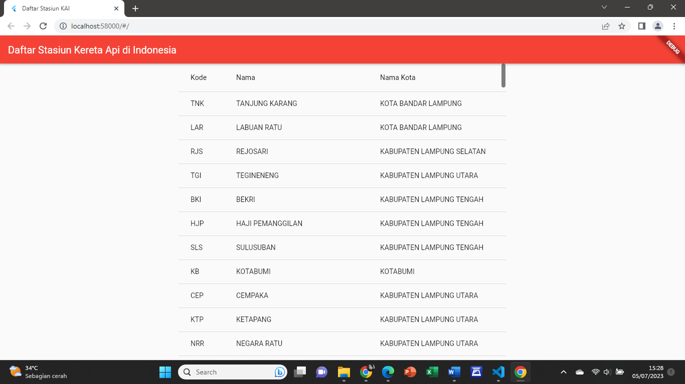

# Pemrograman Mobile 2 - API

## Membuat Tampilan List API dengan Menggunakan Flutter

Program ini dibuat untuk menampilkan daftar nama stasiun kereta api di Indonesia dengan mengambil data API yang disediakan oleh PT KAI. Data API bisa dilihat di link berikut [API KAI](https://booking.kai.id/api/stations2). Berikut merupakan source code untuk **main.dart**:

```dart
    import 'dart:convert';
    import 'package:flutter/material.dart';
    import 'package:http/http.dart' as http;

    void main() {
    runApp(MyApp());
    }

    class MyApp extends StatelessWidget {
    @override
    Widget build(BuildContext context) {
        return MaterialApp(
        title: 'Daftar Stasiun KAI',
        theme: ThemeData(
            primarySwatch: Colors.red,
        ),
        home: MyHomePage(title: 'Daftar Stasiun Kereta Api di Indonesia'),
        );
    }
    }

    class MyHomePage extends StatefulWidget {
    MyHomePage({Key? key, required this.title}) : super(key: key);

    final String title;

    @override
    _MyHomePageState createState() => _MyHomePageState();
    }

    class _MyHomePageState extends State<MyHomePage> {
    late Future<List<dynamic>> _stations;

    Future<List<dynamic>> fetchStations() async {
        final response = await http.get(Uri.parse('https://booking.kai.id/api/stations2'));
        if (response.statusCode == 200) {
        return json.decode(response.body);
        } else {
        throw Exception('Failed to load data');
        }
    }

    @override
    void initState() {
        super.initState();
        _stations = fetchStations();
    }

    @override
    Widget build(BuildContext context) {
        return Scaffold(
        appBar: AppBar(
            title: Text(widget.title),
        ),
        body: Center(
            child: FutureBuilder<List<dynamic>>(
            future: _stations,
            builder: (context, snapshot) {
                if (snapshot.hasData) {
                List<dynamic> data = snapshot.data!;
                return SingleChildScrollView(
                    child: DataTable(
                    columns: [
                        DataColumn(label: Text('Kode')),
                        DataColumn(label: Text('Nama')),
                        DataColumn(label: Text('Nama Kota')),
                    ],
                    rows: data
                        .map((item) => DataRow(cells: [
                                DataCell(Text(item['code'].toString())),
                                DataCell(Text(item['name'].toString())),
                                DataCell(Text(item['cityname'].toString())),
                            ]))
                        .toList(),
                    ),
                );
                } else if (snapshot.hasError) {
                return Text("${snapshot.error}");
                }
                return CircularProgressIndicator();
            },
            ),
        ),
        );
    }
    }
```

* Menggunakan `package http` untuk melakukan permintaan HTTP GET ke API yang diberikan.
  
* Menggunakan `FutureBuilder` untuk menampilkan loading spinner saat data sedang dimuat dan menampilkan tabel setelah data selesai dimuat.
  
* Data diubah menjadi tipe `List<dynamic>` dan ditampilkan dalam `DataTable` dengan tiga kolom: kode, Nama, dan Nama Kota.

* Setelah membuat source code pada **main.dart**, lalu tambahkan package http pada **pubspec.yaml** seperti berikut:

```dart
    dependencies:
        flutter:
            sdk: flutter
        http: ^0.13.3
        json_annotation: ^4.1.0
```

* Lalu jalankan perintah **flutter pub get** di terminal, perintah ini digunakan untuk mengambil semua paket (dependencies) yang didefinisikan dalam file **pubspec.yaml** dan mengunduhnya ke dalam project yang kita buat. Setelah semua paket berhasil diunduh, jalankan perintah **flutter run**.

## Screenshot Tampilan Web




## Screenshot Tampilan Mobile


## Terima Kasih!